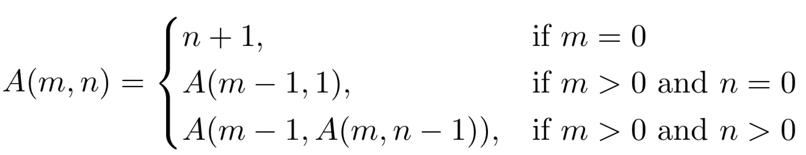
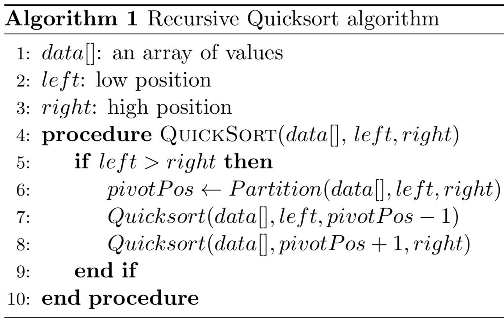
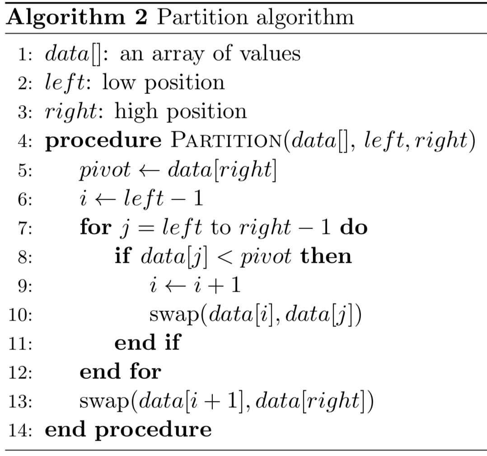

# Ackermann-Quicksort-Experiments
Analysis of recursion in C and Python for the Ackermann Function and Quicksort Algorithm.

_This piece of work accompanies the CIS*6650 - A Study of Programming Languages Final Assignment._

## Table of Contents
* [Ackermann Function](#ackermann-function)
    * [Ackermann Experiments](#ackermann-experiments)
        * [C Implementation](#c-implementation)
        * [Python Implementation](#python-implementation)
* [Quicksort Algorithm](#quicksort-algorithm)
    * [Quicksort Experiments](#quicksort-experiments)
        * [C Implementation](#c-implementation)
        * [Python Implementation](#python-implementation)
* [References](#references)

## Ackermann Function

The Ackermann function, named after the German mathematician Wilhelm Ackermann, is the first compuitable function that is not primitive recurive and is a critical component of proof theory in the early 20th century. The original Ackermann function required three arguments which were defined recursively as follows for nonnegative integers m, n, and p. The version of Ackermann’s function that tends to be used nowadays is the one modified by Hungarian mathematician, Rosza Peter and by American mathematician, Raphael Robinson, which only requires two arguments. In both C and Python implementations, we declare a function *ackermann(m, n)*, a function with two incoming integer arguments (*m* and *n*) and returns an integer result, *ans*.



Experiments were done to solve **ackermann(1,6)**, **ackermann(2,6)**, and **ackermann(3,6)** :

### Ackermann Experiments
#### C Implementation

Run experiments as follows:
```sh
./run_c_ackermann.sh
```

#### Python implementation

Run experiments as follows:
```sh
./run_python_ackermann.sh
```

## Quicksort Algorithm Experiments
Recursive sorting algorithms have left an indelible mark on the history of computer science. The Quicksort function developed by computing pioneer, Sir Charles Antony Richard Hoare, is one of the most popular sorting methods used today for general purpose sorting. Quicksort is being widely used today for different purposes and it is one of the more efficient sorting algorithms. The average time complexity of Quicksort is *O(nlogn)* and can be implemented in a space complexity of *O(log n)*. Another benefit of Quicksort is that it is executed in place, resulting in very good space efficiency.

Quicksort is a divide and conquer algorithm , which works by partitioning an array of data into two pieces. We partition based on what is less than or greater than a pivot value. In Hoare’s implementation, the partitioning scheme involves selecting the element in the right most index as the pivot. Then, we call Quicksort on each sub-partition, which is why it is a recursive algorithm. These sub-partitions then get repartitioned over and over again, recursively, until we end up with single values in the end. The recursive version of Quicksort is presented in Algorithm 1 and the partition function is presented in Algorithm 2.





Experiments were done to sort lists containing random integers of size **100**, **1000**, **10,000**, and **100,000**, where integers were between 0 to 1,000,000.

#### C Implementation

Run experiments as follows:
```sh
./run_c_quicksort.sh
```

#### Python implementation

Run experiments as follows:
```sh
./run_python_quicksort.sh
```

## References
* G. D ̈otzel. A function to end all functions. Algorithm: Recreational Programming 2, pages 16–17, Feb. 1991.
* C. A. R. Hoare. Quicksort. The Computer Journal, 5(1):10–16, 1962. doi: 10.1093/comjnl/5. 1.10. URL http://comjnl.oxfordjournals.org/cgi/content/abstract/5/1/10.
* A. R. Meyer and D. M. Ritchie. The complexity of loop programs. In Proceedings of the 1967 22Nd National Conference, ACM ’67, pages 465–469, New York, NY, USA, 1967. ACM. doi: 10.1145/800196.806014. URL http://doi.acm.org/10.1145/800196.806014.
* R. P ́eter. Konstruktion nichtrekursiver funktionen. Mathematische Annalen, 111(1):42–60, Dec. 1935. ISSN 1432-1807. doi: 10.1007/BF01472200.
* R. M. Robinson. Recursion and double recursion. Bull. Amer. Math. Soc., 54(10):987–993, 10 1948. URL https://projecteuclid.org:443/euclid.bams/1183512393.
